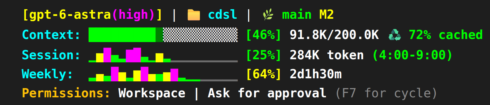
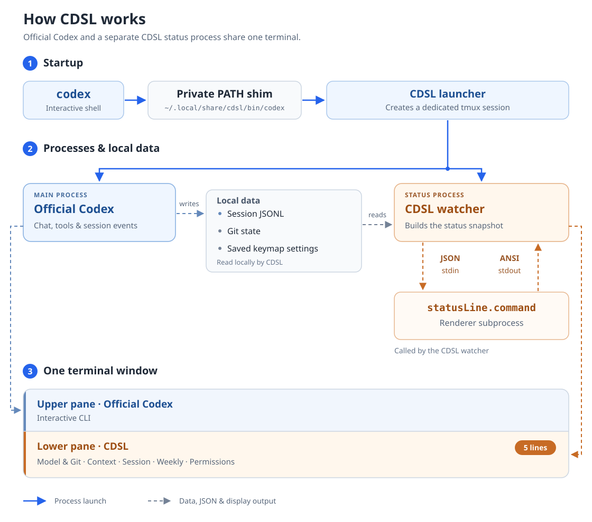

# CDSL (CoDex StatusLine)

[日本語](README.md) | English

CDSL adds a CCSL-inspired status display when you run `codex`. It keeps the model, context usage, session and weekly limits, and permissions in five rows at the bottom of your terminal. CDSL is an independent, unofficial companion for Codex CLI.

The values below are synthetic examples. Each row starts with two spaces, and one space separates the closing bracket from the next value. Percentage numbers use a minimum width of two characters: `[ 8%]`, `[10%]`, and `[100%]`.



## How it works



When you run `codex`, CDSL's external launcher starts official Codex and a separate status process. tmux divides the terminal into an upper pane for Codex and a lower pane for the five-row display. The official Codex executable stays intact.

The status process reads the active conversation's local log, Git information, and saved shortcut settings. It passes that data as JSON to the configured renderer, then displays the returned colored text in the lower pane. Codex's conversation interface and the CDSL display run as separate processes.

`statusLine.command` belongs to CDSL's configuration. Codex 0.153.4 has no setting that embeds an external command's output in its own footer, so CDSL provides the integration.

CDSL normally refreshes once per second. It reads the `thread_settings_applied` event recorded immediately after a permission change, so the Permissions row updates without another prompt. Events owned by another thread are ignored. CDSL follows the root conversation being written by the process it launched, excluding subagents and history files opened only for reading. It waits when the conversation is switching or multiple candidates exist.

Commands such as `codex exec`, `codex update`, help, and non-TTY invocations pass their arguments directly to official Codex. For interactive sessions, CDSL disables the native status line through a startup argument. An explicit setting supplied later in the user's arguments takes precedence.

## Requirements

- Linux or WSL, with Bash and Git
- Python 3.11 or later
- tmux 3.2 or later, tested with 3.4
- Codex CLI, tested with 0.153.4; `install.sh` installs it if missing

Both standalone and npm installations of Codex within Linux are supported. macOS, native Windows, and remote Codex connections are outside the supported scope.

`install.sh` installs missing packages through apt/dnf. For normal setup, continue to Installation below. Manual package instructions are available here if you manage dependencies yourself.

<details>
<summary>Installing packages manually</summary>

If the required packages are missing on Ubuntu 24.04 or Debian 12, run:

```bash
sudo apt update
sudo apt install python3 tmux git bash bubblewrap
python3 --version
tmux -V
```

Check that `python3 --version` reports 3.11 or later and `tmux -V` reports 3.2 or later. The standard packages provide [Python 3.12 on Ubuntu 24.04](https://packages.ubuntu.com/noble/python3) and [Python 3.11 on Debian 12](https://packages.debian.org/bookworm/python3).

On RHEL-based systems (such as AlmaLinux and Rocky Linux), choose Python according to the release and enabled repositories. The following examples use official RHEL packages; CDSL has not been tested on a RHEL installation. On a compatible distribution, first confirm that the same packages are available.

The default `python3` in [RHEL 9](https://docs.redhat.com/en/documentation/red_hat_enterprise_linux/9/html/installing_and_using_dynamic_programming_languages/assembly_installing-and-using-python_installing-and-using-dynamic-programming-languages) is 3.9, which does not meet CDSL's requirements. On RHEL 9.4 and later, use the additional Python 3.12 package:

```bash
sudo dnf install git bash tmux python3.12 bubblewrap
python3.12 --version
tmux -V
```

For this RHEL 9 setup, replace `python3` throughout the remaining instructions with `python3.12`. Automatic startup also uses the Python interpreter selected when CDSL was installed.

[RHEL 10](https://docs.redhat.com/en/documentation/red_hat_enterprise_linux/10/html/installing_and_using_dynamic_programming_languages/installing-and-using-python) provides Python 3.12 as its default:

```bash
sudo dnf install git bash tmux python3 bubblewrap
python3 --version
tmux -V
```

Check the [RHEL Application Streams life cycle](https://access.redhat.com/support/policy/updates/rhel-app-streams-life-cycle) for supported releases and Python support periods.

You can install Codex using the [official Codex CLI instructions](https://learn.chatgpt.com/docs/codex/cli). See the [official sandbox documentation](https://learn.chatgpt.com/docs/sandboxing) for `bubblewrap` and any additional OS setup required for Linux sandboxing.

</details>

## Installation

Run this single line in a regular Linux / WSL terminal with `curl` available. Git does not need to be installed first, and you do not need to clone the repository manually.

```bash
curl -fsSL https://raw.githubusercontent.com/takamasa-aiso/cdsl/main/install.sh | sh
```

The installer fetches CDSL into `~/.local/share/cdsl/source`, installs missing packages and Codex if needed, and configures automatic startup. After it finishes, run `codex` in a new Bash terminal.

**To install and activate CDSL in your current Bash shell in one line**, use:

```bash
(set -o pipefail; curl -fsSL https://raw.githubusercontent.com/takamasa-aiso/cdsl/main/install.sh | sh) && . "$HOME/.config/cdsl/shell.sh"
```

The piped `sh` cannot change its parent's PATH, so the final `.` loads the settings into your current Bash shell. `pipefail` also detects download failures and applies only inside the parentheses. Your current shell's options and working directory are preserved.

Then start Codex as usual:

```bash
codex
codex resume
```

The installer performs these steps:

- Installs Bash and Git through apt/dnf when missing, then fetches CDSL.
- Installs missing runtime dependencies, including Python 3.11+, tmux 3.2+, and Codex's `bubblewrap`. On RHEL 9-based systems it selects Python 3.12 when needed.
- If official Codex is missing, checks curl, certificates, archive tools, and other requirements, then uses the [official installer](https://learn.chatgpt.com/docs/codex/cli) to install the tested Codex CLI 0.153.4. Existing Codex selections are preserved.
- Rechecks dependencies and existing settings before configuring CDSL startup. Existing rendering settings are preserved.

Windows executables and npm launch shims inherited through WSL's PATH are excluded from automatic selection. If no Linux Codex is available, the installer installs the Linux standalone version. You do not need to change Windows-side Node.js or Codex. Linux executables stored on a Windows-mounted drive are not excluded just because of their location.

Only package installation uses sudo, which may ask for your password. Do not run the whole script through sudo. Complete Codex's first-run sign-in when prompted if you have not signed in yet.

Exit Codex and run the installer at your regular terminal prompt. A `codex` alias or function takes precedence over PATH and needs to be checked separately.

To preview changes or select a repository branch, an existing Python interpreter, or official Codex explicitly:

```bash
curl -fsSL https://raw.githubusercontent.com/takamasa-aiso/cdsl/main/install.sh | sh -s -- --dry-run
curl -fsSL https://raw.githubusercontent.com/takamasa-aiso/cdsl/main/install.sh | sh -s -- --ref main --python /usr/bin/python3.12 --real-codex "$HOME/.local/bin/codex"
```

`--dry-run` does not clone or update CDSL, install packages, or change settings. Downloaded source and installed dependencies are retained if later setup fails; resolve the error and run the same command again. OS security settings and organizational restrictions are not changed automatically.

### Installing from an existing checkout

If you have already cloned CDSL or extracted its ZIP archive, run this inside that directory. The installer uses your existing directory directly:

```bash
sh ./install.sh && . "$HOME/.config/cdsl/shell.sh"
```

You can also source the Bash setup script to activate the current shell directly:

```bash
source ./scripts/setup.sh
```

### Configuring CDSL without installing packages

If you manage dependencies yourself, the Python command remains available inside the CDSL directory. It stops before writing CDSL settings when prerequisites are missing:

```bash
python3 scripts/cdsl.py install --codex
source ~/.config/cdsl/shell.sh
```

### Finding the official Codex executable

Codex's location depends on how it was installed and configured. These are common examples:

| Installation | Example official Codex entry |
|---|---|
| Standalone | `~/.local/bin/codex` links to `~/.codex/packages/standalone/current/bin/codex` |
| Global npm installation | `<prefix>/bin/codex`, for example `/usr/local/bin/codex` |
| npm with an nvm-managed Node version | `~/.nvm/versions/node/<version>/bin/codex` |

In Bash on Linux, check the actual candidates with the following commands. `type -a` includes functions and aliases; `type -aP` lists executable files on `PATH`.

```bash
type -a codex
type -aP codex
```

For npm installations, find `<prefix>` with:

```bash
npm prefix -g
```

To inspect a candidate's symlink target, substitute its actual path:

```bash
readlink -f "$HOME/.local/bin/codex"
```

After CDSL is installed, its dedicated `~/.local/share/cdsl/bin/codex` entry may appear first. Do not pass that entry to `--real-codex`; select an official Codex entry from the candidates above. Use an entry that remains at the same location across updates, rather than a version-specific internal path shown by `readlink`.

On WSL, select a Linux Codex executable. Windows npm launch shims and Windows executables cannot be used through `--real-codex` either.

CDSL prefers the standalone installation's `current` entry, then searches `PATH`. You can select the official executable explicitly when needed:

```bash
python3 scripts/cdsl.py install --codex --real-codex "$HOME/.local/bin/codex"
```

This example uses a common standalone path. If your installation is elsewhere, substitute the official entry you identified.

Keep the directory used for installation: CDSL runs directly from it. For automatic downloads, this is `~/.local/share/cdsl/source`. If you move it, rerun the installer from the new location and update `command` in the rendering configuration to the new absolute path. The installer preserves existing rendering settings.

## Reading the display

| Row | Meaning |
|---|---|
| Header | Model, working directory, and Git branch and change count when available |
| Context | Context usage in the current conversation: percentage, tokens used, capacity, and cache ratio |
| Session | Account usage of the five-hour limit, plus cumulative tokens in the displayed conversation |
| Weekly | Account usage of the weekly limit and time until reset |
| Permissions | Permission scope and approval policy applied to the current conversation |

Session and Weekly percentages describe the account's limits. Their graphs show **token consumption within the displayed conversation**, without aggregating other conversations on the account.

Bar heights show relative consumption in each time interval, scaled between the lowest and highest values in the displayed period. When a reset time is available, the graph covers that limit's period. Without a reset time, such as when Session shows `N/A`, the Session graph uses the preceding five hours. As time passes, interval boundaries move and the scale can change when the largest value leaves the window. Bars can therefore move or change height without new token usage. They do not represent remaining allowance or elapsed time directly.

CDSL identifies limits by `window_minutes`. If the returned limits do not include a five-hour window, Session shows `[N/A]` alongside the available conversation token count. A weekly limit returned in the API's `primary` slot is still displayed under Weekly.

If the five-hour limit returns and Codex records its usage percentage and a valid reset time with `window_minutes = 300` in the current conversation log, Session automatically changes from `[N/A]` to its usage percentage. No reinstallation or manual configuration is needed. CDSL reads Codex's logs on its default one-second refresh cycle instead of querying the usage API directly, so it cannot detect the returning limit until the log updates.

On narrow terminals, labels and graphs are shortened. `[--]` means a limit has not been received or its recorded period has expired. `Permissions: unknown` means permission information is not yet available. If CDSL cannot identify the active conversation unambiguously, it displays a waiting message.

Clock times and time ranges use Japan Standard Time (JST, UTC+09:00).

## Permissions and shortcuts

The row reads `Permissions: scope | approval policy`. The `Permissions:` label uses `#FFC107`, the warning color in Claude Code's default dark theme. The first configured shortcut appears beside the values, separated by one space:

| Shortcut state | Hint |
|---|---|
| Assigned, for example to `F7` | `(F7 for cycle)` |
| Unassigned | `(/keymap to set cycle key)` |
| Cannot be determined | `(/keymap to check cycle key)` |

CDSL reads the saved user keymap from `$CODEX_HOME/config.toml`, normally `~/.codex/config.toml`. When Codex is started with `--profile <name>`, it also reads `<name>.config.toml` in the same directory. If the action is defined in project, system, or command-line settings, or the saved configuration cannot be read reliably, CDSL shows the check hint instead of a key name.

`Never` means Codex does not request execution approval. It can run operations within the allowed scope; operations that require approval are denied without an approval prompt. Scope is a separate setting: `Read Only | Never` means read-only access, while `Full Access | Never` means no Codex sandbox restriction and no execution approval requests.

| Permission scope | Meaning |
|---|---|
| `Read Only` | The built-in read-only profile |
| `Workspace` | Writes are allowed in the workspace and other permitted locations |
| `Full Access` | No Codex sandbox restriction; OS and organizational restrictions still apply |
| `Custom permissions` | A permission configuration that does not match a built-in display label |
| A profile name | The name of the active custom profile |
| `unknown` | Effective permission information is not yet available |

| Approval policy | Meaning |
|---|---|
| `Ask for approval` | Codex asks the user when it determines approval is needed |
| `Approve for me` | Operations requiring approval go through automatic review, which can reject them |
| `Never` | Execution approval is never requested; operations requiring it are denied |
| `On request` | Approval is requested as needed, but the log does not identify the reviewer |
| `Untrusted` | Commands outside the known safe set require approval |
| `Granular` | Approval categories are configured individually to allow a request or reject it automatically |
| `On failure` | Approval to retry outside the sandbox is requested after a sandboxed failure; deprecated in Codex |
| `unknown` | The approval policy is unavailable or not recognized |

For reducing manual permission prompts through automatic review, `Approve for me` is the closest practical counterpart to Claude Code's `auto` mode. Both can reject actions during review. Codex retains its sandbox and sends eligible approval requests to a reviewer; Claude Code uses its own classifier and rules. This is a comparison of workflows, whose review mechanisms and rules remain distinct. See [Codex Auto-review](https://learn.chatgpt.com/docs/sandboxing/auto-review) and [Claude Code auto mode](https://code.claude.com/docs/en/permission-modes#eliminate-permission-prompts-with-auto-mode).

These labels summarize the conversation's effective settings. Use Codex's `/permissions` or `/status` to inspect individual paths and rules. On narrow terminals, CDSL can shorten `Permissions:` to `P:`, `Custom permissions` to `Custom`, `Ask for approval` to `Ask`, and `Approve for me` to `Auto review`. Hints shorten to `(F7)`, `(set /keymap)`, or `(check /keymap)`. Permission values can be clipped to keep the hint visible; at extremely narrow widths, the hint is also omitted.

In Codex's `/keymap`, assign a key to `next_permission_mode`. Close the menu, then press that key in the Codex input area to cycle permissions. This action is unassigned by default in Codex 0.153.4. Applied changes appear in CDSL on its normal refresh cycle, one second by default, without sending another prompt. Changes made through `/permissions` work the same way.

Use `/keymap` to change the shortcut in a running Codex session. Editing the configuration file directly does not guarantee that Codex's current interface reloads the binding immediately.

The latest stable release is [Codex CLI 0.153.4](https://github.com/openai/codex/releases/tag/rust-v0.153.4), checked on 2026-09-07 (JST). In its running interface, `next_permission_mode` cycles through the available Read Only, Ask for approval, and Approve for me modes. Full Access is outside that cycle; select it through `/permissions`. This describes in-session controls; startup flags such as `--yolo` are separate.

Codex determines the available modes and any confirmation steps. Close menus and popups before using the shortcut. Shortcut changes apply to the current conversation.

## Updates

| Location | Purpose |
|---|---|
| `~/.local/share/cdsl/bin/codex` | CDSL's dedicated startup entry |
| `~/.config/cdsl/shell.sh` | Adds that entry to the front of `PATH` |
| `~/.bashrc` | Loads the integration for interactive Bash shells |
| Bash login configuration | Adds a managed block to the file Bash uses, following `.bash_profile`, `.bash_login`, `.profile` precedence |
| `~/.config/cdsl/config.toml` | Rendering command and refresh interval |
| `~/.local/share/cdsl/startup.json` | Installation state used for updates and uninstallation |

CDSL's entry remains in place when the official Codex installer replaces its own entry. Standalone installations retain the `current` path; npm installations retain the selected executable path. Updates at the same installation location are picked up automatically.

If Codex moves to a different location, for example after switching Node versions, rerun the installer with `--real-codex` pointing to the new path. Changes to Codex's log format or CLI behavior may require a CDSL update.

To update CDSL, run the same command used for installation:

```bash
curl -fsSL https://raw.githubusercontent.com/takamasa-aiso/cdsl/main/install.sh | sh
```

The managed checkout is updated only when its origin matches this repository, it has no local edits, and the requested update is a fast-forward. Untracked Python bytecode does not block updates. Local edits or diverging history stop the update.

If you use your own clone, run this inside that directory:

```bash
git pull --ff-only && source ./scripts/setup.sh
```

The installer preserves existing shell configuration and changes only its managed blocks. It saves backups with file permissions `0600`. If a managed block has been edited externally or a shell configuration file is a symbolic link, installation stops with an error instead of overwriting it.

## Rendering configuration (optional)

**No separate configuration is needed after following the installation steps.** When the file is missing, `install --codex` creates `~/.config/cdsl/config.toml` with the absolute paths of the Python interpreter used for installation and the bundled renderer. Existing settings are preserved.

The following example is a reference for customizing the renderer or refresh interval. You do not need to copy or run it during normal installation:

```toml
[statusLine]
command = ["/usr/bin/python3", "/absolute/path/to/cdsl/scripts/statusline.py"]
timeout_seconds = 2.0
refresh_interval = 1.0
```

The Python and clone paths in the example vary by environment. To use a different configuration file, create it yourself and set `CDSL_CONFIG` to its path; that file is not created automatically. `command` is an argument array executed without a shell, so `~`, variables, pipes, and other shell syntax are not expanded.

CDSL uses a version 1 JSON protocol. The integration sends a request on standard input, and the renderer returns UTF-8 text with ANSI formatting on standard output:

```json
{
  "version": 1,
  "session": {
    "now": "2026-01-01T12:00:00+09:00",
    "model": "example-model",
    "cwd": "/workspace/project",
    "context_tokens": 91800,
    "context_window": 200000,
    "weekly_used_percent": 64
  },
  "terminal": {"columns": 100, "rows": 24, "color": true}
}
```

`session` contains normalized usage, Git, and permission information. `session.now` supplies the rendering time; the default renderer does not read session logs or the clock independently. `terminal.rows` carries screen information for the protocol. The default renderer always produces five rows.

Standard output and standard error are each limited to 64 KiB. Timeouts and command failures are reported in the display area while Codex remains usable.

## Pasting images

Copy an image and press `Ctrl+v` in the Codex input area. In some environments, `Alt+v` can paste when `Ctrl+v` does not work.

Codex 0.153.4 also provides `Ctrl+Alt+v` as a standard alternate binding. Its standard image-paste keys are fixed, outside the editable actions in `/keymap`. See the [Codex key definitions](https://github.com/openai/codex/blob/rust-v0.153.4/codex-rs/tui/src/keymap.rs#L2164).

To see which key reaches Codex, open `/keymap`, select `Inspect keypresses` on the `Debug` tab, and press Enter. Press `Ctrl+c` to leave the inspector. If the key does not arrive, check the terminal's bindings. See the [Codex key inspector](https://github.com/openai/codex/blob/rust-v0.153.4/codex-rs/tui/src/keymap_setup/picker.rs#L312).

If clipboard access is unavailable, save the image to a local file and paste its path into the input area to attach it. Confirm that the image is attached before submitting your prompt.

On WSL, CDSL adds a `Ctrl+v` helper that uses available Windows PowerShell to convert clipboard images to PNG attachments, falling back to Codex's standard handling if retrieval fails.

## Diagnostics and uninstallation

Run the following commands from the CDSL directory used for installation: `~/.local/share/cdsl/source` for automatic downloads.

### Diagnostics

```bash
python3 scripts/cdsl.py doctor
```

`doctor` runs the same prerequisite checks as the installer and reports `OK` or `NG` for each item, with details of any problems. It does not change settings or repair them automatically, and it can also run before installation.

| Diagnostic item | What it checks |
|---|---|
| Runtime environment | Linux / WSL, Python 3.11 or later, Bash and Git availability, and tmux 3.2 or later |
| CDSL runtime files | Required Python files exist, can be read, and have valid syntax |
| Official Codex and startup settings | The official Codex executable path and consistency of CDSL's installation state and shell configuration |
| Renderer configuration and command | Configuration format and values, and the existence and execute permissions of the first executable in the command |

On WSL, it also reports PowerShell availability for the image clipboard helper as an optional item. PowerShell is not required for the status display.

It does not test Codex sign-in, the renderer's actual output, conversation or usage retrieval, or image pasting. `OK` means the prerequisite check passed; it does not confirm that installation is complete or every feature works.

### Reloading the display

To reload only the lower display while keeping the current Codex session running, execute this from that session:

```bash
python3 scripts/refresh-statusline.py
```

### Uninstallation

```bash
python3 scripts/cdsl.py uninstall --codex --dry-run
python3 scripts/cdsl.py uninstall --codex
```

`--dry-run` only previews the changes. Uninstallation deletes CDSL's managed shell blocks and dedicated entry; rendering settings, backups, downloaded CDSL source, official Codex, and installed OS packages are retained.

After the uninstall command finishes, clear the cached command location and check resolution at the original Bash prompt where you normally launch `codex`:

```bash
hash -r
type -a codex
type -aP codex
```

Run `hash -r` in that calling Bash shell. CDSL's Python process cannot clear the parent shell's cache. Opening a new terminal also applies the change.

When the uninstall command can locate official Codex, it prints an absolute path for direct startup. Run that path if `codex` still cannot be found. If no path is printed, use “Finding the official Codex executable” above or reinstall official Codex.

## Reporting security issues

Please report security issues through [GitHub private vulnerability reporting](https://github.com/takamasa-aiso/cdsl/security/advisories/new). See [SECURITY.md](SECURITY.md) for the information to include and how to handle sensitive details.

## Release notes policy

Each CDSL version published through [GitHub Releases](https://github.com/takamasa-aiso/cdsl/releases) includes the following three sections, with Japanese first and English alongside it:

| Section | Required content |
|---|---|
| 変更内容 / Changes | Additions, fixes, and user-facing changes since the previous release; main features for the first release |
| 対応するCodexのバージョン / Codex compatibility | The Codex CLI versions actually tested; untested versions are not described as supported |
| 既知の制限 / Known limitations | Platform, data, display, and performance constraints, plus unresolved issues and workarounds; explicitly state when none apply |

Each release tags the commit being published, and its notes describe that version. Release history belongs in Releases; this README describes current behavior and usage.

## Repository contents

| Location | Purpose |
|---|---|
| `cdsl/` | Startup integration, session collection, rendering, and clipboard handling |
| `install.sh` | POSIX sh entry point that fetches and installs CDSL |
| `scripts/setup.sh` | Bash dependency setup, CDSL configuration, and current-shell activation when sourced |
| `scripts/cdsl.py` | Entry point for installation, diagnostics, uninstallation, and startup |
| `scripts/statusline.py` | Converts JSON into colored display text |
| `scripts/paste-image.py` | Entry point for the WSL clipboard helper |
| `scripts/refresh-statusline.py` | Reloads only the display in a running session |
| `assets/statusline-preview.png` | Example rendered by the current CDSL renderer |
| `assets/how-it-works.ja.png` | Japanese diagram of startup, local data flow, and terminal panes |
| `assets/how-it-works.svg` | English diagram of the same architecture |
| `README.md`, `README.en.md` | Japanese and English usage documentation |
| `SECURITY.md` | How to report security issues privately |
| `THIRD_PARTY_NOTICES.md` | CCSL-derived portions, source attribution, original copyright notice, and license terms |
| `LICENSE` | License terms and copyright notices |

## Credits and license

- [Codex configuration reference](https://learn.chatgpt.com/docs/config-file/config-reference)
- [Codex approvals and security](https://learn.chatgpt.com/docs/agent-approvals-security)
- [Codex 0.153.4 permission shortcuts](https://github.com/openai/codex/blob/rust-v0.153.4/codex-rs/tui/src/chatwidget/permission_shortcuts.rs)
- [Official Codex installer](https://github.com/openai/codex/blob/rust-v0.153.4/scripts/install/install.sh)

CDSL's copyright notices and MIT license terms are in [LICENSE](LICENSE). The CCSL-derived portions, their source, original copyright notice, and license terms are documented in [THIRD_PARTY_NOTICES.md](THIRD_PARTY_NOTICES.md). Attribution does not imply endorsement by OpenAI or the CCSL author.
