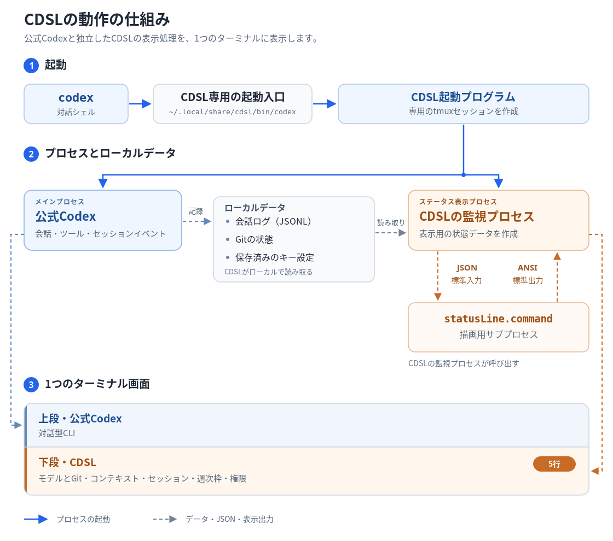

# CDSL (CoDex StatusLine)

日本語 | [English](README.en.md)

通常の `codex` 起動に、CCSLを基にしたステータス表示を追加します。モデル、Context、Session、Weekly、権限モードを端末の下部5行にまとめます。CDSLは独立した非公式のCodex CLI向けツールです。

以下は表示例です。数値は合成サンプルです。全行の左端に半角スペース2つを付け、閉じ括弧と後続値の間は半角スペース1つです。使用率の数値は最低2桁幅に揃え、`[ 8%]`・`[10%]`・`[100%]`のように表示します。


## 呼び出しの仕組み



`codex`を実行すると、CDSLの外部ランチャーが公式Codexとステータス表示用の処理を起動します。tmuxが端末を上下に分け、上段にCodex、下段に5行のステータスを配置します。公式Codexの実行ファイルは保持します。

表示用の処理は、現在の会話のローカルログ、Git情報、保存されたキー設定を読み、JSONとして設定済みの描画プログラムへ渡します。返ってきた色付き文字列を下段に表示します。Codexの会話画面とCDSLの表示は、別のプロセスとして動作します。

`statusLine.command` はCDSLの設定です。Codex 0.153.4には外部コマンドの出力を本体footerへ埋め込む設定がないため、CDSLが呼び出し役を担います。これは非公式の拡張です。

通常は1秒ごとに更新します。`/permissions`や権限切替ショートカットの変更直後に記録される`thread_settings_applied`を読み、次のプロンプトを待たずにPermissions行へ反映します。別スレッド所有の設定イベントは取り込みません。起動したプロセスが書き込み中の親会話を追跡し、子エージェントや読み取り用に開かれた履歴を除外します。会話切替中や候補が複数あるときは、別の会話を推測して表示しません。

`codex exec`、`codex update`、ヘルプ、非TTY実行などは公式Codexへ引数をそのまま渡します。対話セッションでは、Codex標準のstatuslineを起動引数で非表示にします。ユーザーが後から渡した同じ設定の引数が優先されます。

## 対応環境

- Linux / WSL、BashとGit
- Python 3.11以上
- tmux 3.2以上（3.4で検証）
- 導入・ログイン済みのCodex CLI（0.153.4で検証）

Codexのstandalone版とnpm版に対応します。macOS、Windowsネイティブ版、リモートCodex接続は対象外です。

Ubuntu 24.04またはDebian 12で必要なパッケージが不足している場合は、次を実行します。

```bash
sudo apt update
sudo apt install python3 tmux git bash
python3 --version
tmux -V
```

`python3 --version`が3.11以上、`tmux -V`が3.2以上であることを確認してください。標準パッケージは[Ubuntu 24.04ではPython 3.12](https://packages.ubuntu.com/noble/python3)、[Debian 12ではPython 3.11](https://packages.debian.org/bookworm/python3)です。

RHEL系（AlmaLinux、Rocky Linuxなど）では、リリースと利用中のリポジトリに応じてPythonを選びます。次はRHELの公式パッケージに基づく導入例で、CDSLのRHEL実機検証は行っていません。互換ディストリビューションでは、同じパッケージが提供されていることを確認してください。

[RHEL 9](https://docs.redhat.com/en/documentation/red_hat_enterprise_linux/9/html/installing_and_using_dynamic_programming_languages/assembly_installing-and-using-python_installing-and-using-dynamic-programming-languages)の標準`python3`は3.9のため、そのままではCDSLの要件を満たしません。RHEL 9.4以降では、追加のPython 3.12を使います。

```bash
sudo dnf install git bash tmux python3.12
python3.12 --version
tmux -V
```

このRHEL 9向け手順では、以降の`python3`を`python3.12`に読み替えてください。自動起動時も、CDSLの導入に使ったPythonを利用します。

[RHEL 10](https://docs.redhat.com/en/documentation/red_hat_enterprise_linux/10/html/installing_and_using_dynamic_programming_languages/installing-and-using-python)は標準のPython 3.12を使えます。

```bash
sudo dnf install git bash tmux python3
python3 --version
tmux -V
```

対象リリースとPythonのサポート期間は、[RHEL Application Streamsのライフサイクル](https://access.redhat.com/support/policy/updates/rhel-app-streams-life-cycle)で確認できます。

Codexは[公式のCodex CLI導入手順](https://learn.chatgpt.com/docs/codex/cli)でインストールします。CDSLを使う前にログインを済ませてください。未ログインの場合は`codex login`を実行し、[公式の認証手順](https://learn.chatgpt.com/docs/auth)に従います。

## インストール

`curl`が使える環境では、次の2通りで導入できます。本体を`~/.local/share/cdsl/source`へ取得し、apt/dnfで不足パッケージを導入します。Linux版Codexが未導入の場合は併せて導入します。

**1. インストール（完了後は新しいBashで`codex`を実行）**

```bash
curl -fsSL https://raw.githubusercontent.com/takamasa-aiso/cdsl/main/install.sh | sh
```

**2. インストールして現在のBashへも反映**

```bash
(set -o pipefail; curl -fsSL https://raw.githubusercontent.com/takamasa-aiso/cdsl/main/install.sh | sh) && . "$HOME/.config/cdsl/shell.sh"
```

更新・診断・アンインストールのコマンドは、利用したCDSLフォルダー内で実行します。

### 手動で導入する場合

Pythonのインストーラーは、変更前に必要な依存関係をまとめて確認します。不足があれば一覧を表示し、ファイルへ書き込まず停止します。パッケージは自動インストールしません。上記のパッケージ導入コマンドを本人が実行した後、CDSLのインストールをやり直してください。

```bash
git clone https://github.com/takamasa-aiso/cdsl.git
cd cdsl

# Preview the installation changes
python3 scripts/cdsl.py install --codex --dry-run

# Enable automatic startup
python3 scripts/cdsl.py install --codex
```

このインストールで起動連携と描画コマンドの設定が完了します。設定ファイルがなければ自動作成されるため、通常の利用では「描画コマンドの設定」の手順を個別に行う必要はありません。既存の描画設定は保持します。

新しいBashターミナルを開き、通常どおり起動します。

```bash
codex
codex resume
```

現在のシェルへ反映する場合は、シェルのプロンプトで次を実行します。

```bash
source ~/.config/cdsl/shell.sh
```

### 公式Codexのパスを確認する

Codexの場所は導入方法や設定によって異なります。次は一般的な例です。

| 導入方法 | 公式Codexの起動入口の例 |
|---|---|
| standalone版 | `~/.local/bin/codex`から`~/.codex/packages/standalone/current/bin/codex`へリンク |
| npmのグローバル導入 | `<prefix>/bin/codex`（例：`/usr/local/bin/codex`） |
| nvmで管理するNodeへのnpm導入 | `~/.nvm/versions/node/<version>/bin/codex` |

LinuxのBashでは、次のコマンドで実際の候補を確認できます。`type -a`は関数やエイリアスも含め、`type -aP`はPATH上の実行ファイルを表示します。

```bash
type -a codex
type -aP codex
```

npm版の`<prefix>`は、次の出力で確認します。

```bash
npm prefix -g
```

候補のリンク先を調べる場合は、実際のパスに置き換えて次を実行します。

```bash
readlink -f "$HOME/.local/bin/codex"
```

CDSL導入後は、専用の`~/.local/share/cdsl/bin/codex`が検索結果の先頭になることがあります。これは`--real-codex`に指定せず、上の候補から公式Codexの起動入口を選んでください。`readlink`で表示される版ごとの内部パスではなく、更新後も同じ場所にある起動入口を指定すると、Codexの更新に追従できます。

CDSLはstandalone版の`current`を優先し、見つからない場合はPATHから探します。必要に応じて、導入時に公式の実行ファイルを明示できます。

```bash
python3 scripts/cdsl.py install --codex --real-codex "$HOME/.local/bin/codex"
```

上はstandalone版の一般的なパスを使う例です。異なる場所にある場合は、確認した公式Codexの起動入口へ置き換えてください。

CDSLはcloneしたフォルダーから動作します。導入後もこのフォルダーを保持してください。場所を移した場合は、新しい場所からインストールを再実行し、描画設定の `command` も新しい絶対パスへ変更してください。既存の描画設定は自動では上書きしません。

## 表示の意味

| 行 | 表示内容 |
|---|---|
| ヘッダー | モデル、作業ディレクトリ、取得できる場合はGitブランチと変更数 |
| Context | 現在の会話のコンテキスト使用率、使用トークン数、上限、キャッシュ率 |
| Session | アカウントの5時間枠の使用率、対象会話の累計トークン数 |
| Weekly | アカウントの週次枠の使用率とリセットまでの時間 |
| Permissions | 現在の会話に適用された権限の範囲と承認方針 |

Session / Weeklyの使用率はアカウントの値です。グラフは**対象会話内のトークン消費履歴**であり、アカウント全体の全会話を合算したグラフではありません。

縦棒の高さは各時間帯の消費量を表し、集計範囲の最小値と最大値に合わせて相対表示します。リセット時刻が取得できた場合は、その利用期間を描きます。Sessionが`N/A`などでリセット時刻がない場合は、現在から過去5時間の範囲を描き直します。時間経過で集計区間の境界が移動し、区間から最大値が外れると縮尺も変わるため、新しい消費がなくても棒の位置や高さが変わります。残量や経過時間そのものを示す棒ではありません。

利用枠は `window_minutes` で判定します。返却された利用枠に5時間枠がない場合は、Sessionの使用率を `[N/A]` とし、取得できた会話のトークン数を表示します。週次枠がAPIの `primary` に入っている場合もWeeklyへ表示します。

5時間枠が再び提供され、`window_minutes = 300`の使用率と有効なリセット時刻が現在の会話ログに記録されると、Sessionは`[N/A]`から使用率へ自動で切り替わります。再インストールや手動設定は不要です。CDSLは利用枠をAPIへ直接問い合わせず、Codexのログを既定1秒の周期で読み取るため、ログが更新されるまでは復活を検知できません。

狭い端末ではラベルやグラフを短縮します。利用枠が未取得・期限切れなら `[--]`、権限情報がまだなければ `Permissions: unknown`、対象会話を一意に特定できなければ待機表示になります。

時刻・時間帯は日本標準時（JST、UTC+09:00）で表示します。

## Permissionsの表示と切替

`Permissions: 権限の範囲 | 承認方針` の順に表示します。`Permissions:`ラベルはClaude Codeの標準ダークテーマのwarning色（`#FFC107`）です。値の横に半角スペース1つを挟み、先頭に設定されたショートカットを表示します。

| ショートカットの状態 | ヒント |
|---|---|
| 設定済み（`F7`を割り当てた例） | `(F7 for cycle)` |
| 未割当 | `(/keymap to set cycle key)` |
| 設定を判定できない | `(/keymap to check cycle key)` |

CDSLは`$CODEX_HOME/config.toml`（通常は`~/.codex/config.toml`）に保存されたユーザーのキー設定を読みます。`--profile <name>`で起動した場合は、同じディレクトリの`<name>.config.toml`も読みます。プロジェクト・システム・コマンドラインの設定に同じアクションの定義がある場合や、保存設定を確実に読み取れない場合は、キー名の代わりに確認用のヒントを表示します。

`Never`は実行時の承認を求めない設定です。許可された範囲内で実行し、承認が必要な操作は確認画面を出さず拒否します。権限の範囲は別の設定なので、`Read Only | Never`なら読み取り専用、`Full Access | Never`ならCodexのサンドボックス制限なし・承認要求なしという意味です。

| 権限の範囲 | 意味 |
|---|---|
| `Read Only` | 読み取り専用の組み込みプロファイル |
| `Workspace` | 作業ディレクトリなど、許可された範囲への書き込みが可能 |
| `Full Access` | Codexのサンドボックス制限なし。OSや組織側の制約は別途適用される |
| `Custom permissions` | 組み込みの表示名に当てはまらない権限設定 |
| プロファイル名 | 名前付きの独自プロファイルを使用中。その名前を表示 |
| `unknown` | 有効な権限情報をまだ取得できていない |

| 承認方針 | 意味 |
|---|---|
| `Ask for approval` | Codexが必要と判断した承認をユーザーへ求める |
| `Approve for me` | 承認が必要な操作を自動レビューへ送る。レビューで拒否される場合もある |
| `Never` | 実行時の承認を求めない。承認が必要な操作は拒否する |
| `On request` | 必要時に承認を求める設定だが、承認先がログから不明 |
| `Untrusted` | 既知の安全なコマンド以外は承認が必要 |
| `Granular` | 承認の種類ごとに、要求を許可するか自動拒否するかを設定 |
| `On failure` | サンドボックス内での失敗後に、制限外での再実行の承認を求める旧設定。Codexでは非推奨 |
| `unknown` | 承認方針を取得できていない、または未対応の方針 |

自動審査で人への確認を減らす使い方では、`Approve for me`がClaude Codeの`auto`モードに最も近い選択肢です。どちらも審査で操作を拒否できます。Codexはサンドボックスを維持し、承認が必要な操作を審査役へ送ります。Claude Codeは独自の分類モデルとルールで判定します。これは実用上の対応づけであり、仕組みやルールが完全に同じという意味ではありません。[Codex Auto-review](https://learn.chatgpt.com/docs/sandboxing/auto-review)、[Claude Code auto mode](https://code.claude.com/docs/en/permission-modes#eliminate-permission-prompts-with-auto-mode)を参照してください。

これらは会話ログの実効設定を短く表したものです。個別の許可パスやルールはCodexの`/permissions`・`/status`で確認できます。狭い端末では`Permissions:`を`P:`、`Custom permissions`を`Custom`、`Ask for approval`を`Ask`、`Approve for me`を`Auto review`へ短縮します。ヒントも`(F7)`・`(set /keymap)`・`(check /keymap)`へ短縮し、必要なら権限の値を省略してヒントを残します。極端に狭い場合はヒントも省略します。

Codexの`/keymap`で`next_permission_mode`にキーを割り当て、メニューを閉じてCodexの入力欄で押すと権限を切り替えられます。Codex 0.153.4では初期状態で未割当です。変更が適用されるとCDSLも通常1秒の更新周期で追従し、次のプロンプト送信は不要です。`/permissions`での変更も同様です。

実行中のCodexのショートカットは`/keymap`から変更してください。設定ファイルを直接編集しても、現在のCodex画面へキー割り当てが即座に再読込されるとは限りません。

2026-09-07（JST）時点の最新安定版は[Codex CLI 0.153.4](https://github.com/openai/codex/releases/tag/rust-v0.153.4)です。この版の実行中の画面では、`next_permission_mode`は利用可能なRead Only・Ask for approval・Approve for meを巡回します。Full Accessは巡回対象外なので、`/permissions`で選択してください。これは実行中の画面での切替についての説明であり、`--yolo`などの起動オプションとは別です。

切替の候補と確認処理はCodex本体に従います。ショートカットはメニューやポップアップを閉じてから操作します。ショートカットによる変更は現在の会話だけに適用されます。

## 更新で起動連携を失わない構成

| 場所 | 役割 |
|---|---|
| `~/.local/share/cdsl/bin/codex` | CDSL専用の起動入口 |
| `~/.config/cdsl/shell.sh` | 専用入口をPATHの先頭へ置く設定 |
| `~/.bashrc` | Bashの対話起動で設定を読み込む管理ブロック |
| Bashのログイン設定 | `.bash_profile`、`.bash_login`、`.profile` の優先順位で実際に使われるファイルへ管理ブロックを追加 |
| `~/.config/cdsl/config.toml` | 描画コマンドと更新間隔 |
| `~/.local/share/cdsl/startup.json` | アンインストール・再設定用の管理情報 |

公式Codexの入口を上書きしないため、公式インストーラーがその入口を作り直してもCDSL専用の入口は残ります。standalone版は `current`、npm版は選択した実行パスを保持し、同じインストール先の更新に追従します。

Nodeのバージョン管理などでCodexのインストール先自体を変えた場合は、`--real-codex` で新しいパスを指定して再登録してください。Codex側のログ形式やCLI仕様が変わった場合はCDSLの対応が必要になることがあります。

CDSLを更新する場合は、このリポジトリ内で次を実行します。

```bash
git pull --ff-only
python3 scripts/cdsl.py install --codex
```

シェル設定の既存部分は保持し、CDSLの管理ブロックだけを追加・更新します。変更前のファイルは0600のバックアップへ保存します。管理ブロックが外部で編集されている場合や、編集対象のシェル設定がシンボリックリンクの場合は、上書きせずエラーにします。

## 描画コマンドの設定（カスタマイズする場合のみ）

**インストール手順を実施すれば、個別の設定は不要です。** `install --codex`が、設定ファイルのない場合に`~/.config/cdsl/config.toml`を自動作成し、導入に使ったPythonと付属の描画スクリプトの絶対パスを登録します。既存の設定は上書きしません。

以下は描画プログラムや更新間隔を変更する場合の参考例です。通常の導入時にコピー・実行する必要はありません。

```toml
[statusLine]
command = ["/usr/bin/python3", "/absolute/path/to/cdsl/scripts/statusline.py"]
timeout_seconds = 2.0
refresh_interval = 1.0
```

例のPythonとclone先のパスは環境によって異なります。別の設定ファイルを使う場合は、そのファイルを用意して `CDSL_CONFIG` にパスを指定してください。指定先は自動作成されません。`command` はシェルを介さず引数配列で実行するため、`~`、変数、パイプなどのシェル展開は使えません。

入出力はCDSLのバージョン1プロトコルです。標準入力へ次のJSONを渡し、描画コマンドはUTF-8のANSI文字列を標準出力へ返します。

```json
{
  "version": 1,
  "session": {
    "now": "2026-01-01T12:00:00+09:00",
    "model": "example-model",
    "cwd": "/workspace/project",
    "context_tokens": 91800,
    "context_window": 200000,
    "weekly_used_percent": 64
  },
  "terminal": {"columns": 100, "rows": 24, "color": true}
}
```

`session` には連携側で正規化した使用量・Git・権限情報が入ります。`session.now` は描画時刻で、既定の描画プログラムはログや時計を独自に読みません。`terminal.rows` はJSONプロトコルの画面情報です。既定の描画は常に5行です。

標準出力と標準エラーの上限はそれぞれ64KiBです。タイムアウトや実行失敗は表示領域に通知し、Codexの操作を継続できます。

## 画像の貼り付け

画像をコピーし、Codexの入力欄で`Ctrl+v`を押します。環境によっては、`Ctrl+v`が効かず`Alt+v`で貼り付けられる場合もあります。

Codex 0.153.4には、標準の代替キーとして`Ctrl+Alt+v`もあります。標準の画像貼り付けキーは固定で、`/keymap`の編集項目には含まれません。[Codexのキー定義](https://github.com/openai/codex/blob/rust-v0.153.4/codex-rs/tui/src/keymap.rs#L2164)

実際に届くキーは、`/keymap`の`Debug`タブで`Inspect keypresses`を選び、Enterを押してから確認できます。`Ctrl+c`で確認画面を終了します。キーが届かなければ端末側の割当を確認してください。[Codexのキー検査画面](https://github.com/openai/codex/blob/rust-v0.153.4/codex-rs/tui/src/keymap_setup/picker.rs#L312)

クリップボードを使えない場合は、画像をローカルファイルへ保存し、そのパスを入力欄へ貼り付けて添付できます。画像として添付されたことを確認してから、プロンプトを送信してください。

WSLでは、`Ctrl+v`にCDSLのWindowsクリップボード補助が入り、利用できるWindows PowerShellで画像をPNGへ変換して添付します（取得できなければCodex標準処理へ戻ります）。

## 診断・アンインストール

以下のコマンドはcloneしたフォルダーで実行します。

### 診断

```bash
python3 scripts/cdsl.py doctor
```

`doctor`は、インストール時と同じ事前確認を行い、項目ごとに`OK`・`NG`と問題の詳細を表示します。設定の変更や自動修復は行わず、導入前にも使えます。

| 診断項目 | 確認内容 |
|---|---|
| 実行環境 | Linux / WSL、Python 3.11以上、Bash・Gitの有無、tmux 3.2以上 |
| CDSLの実行ファイル | 必要なPythonファイルの存在、読み取り可否、構文エラーの有無 |
| 公式Codexと起動設定 | 公式Codexの実行パス、CDSLの管理情報とシェル設定の整合性 |
| 描画設定とコマンド | 設定ファイルの形式・設定値、コマンド先頭の実行ファイルの有無と実行権限 |

WSLでは、画像貼り付け補助に使うPowerShellの有無も任意項目として表示します。これはステータス表示の必須条件ではありません。

Codexのログイン状態、描画コマンドの実行結果、会話・利用量の取得、画像貼り付けの動作は診断しません。`OK`は上記の事前確認を通過したことを示し、インストール完了や全機能の動作確認を意味するものではありません。

### 表示の再読み込み

実行中のCDSL下部表示だけを再読み込みする場合は、そのCodexセッション内から次を実行できます。

```bash
python3 scripts/refresh-statusline.py
```

### アンインストール

```bash
python3 scripts/cdsl.py uninstall --codex --dry-run
python3 scripts/cdsl.py uninstall --codex
```

`--dry-run`は変更予定の確認だけを行います。アンインストールすると、管理ブロックと専用入口を除去し、描画設定・バックアップ・公式Codexは残します。

アンインストールコマンドの終了後、普段`codex`を起動する元のBashプロンプトで、保存済みのコマンド位置を消して解決先を確認してください。

```bash
hash -r
type -a codex
type -aP codex
```

`hash -r`は呼び出し元のBashで実行する必要があり、CDSLのPythonプロセスからそのキャッシュを消すことはできません。新しいターミナルを開く方法でも反映できます。

公式Codexを検出できた場合は、アンインストールコマンドが直接起動用の絶対パスを表示します。`codex`がまだ解決できなければ、そのパスを実行してください。パスも表示されない場合は、上の「公式Codexのパスを確認する」で場所を調べるか、公式Codexを再インストールしてください。

## セキュリティ上の問題の報告

セキュリティ上の問題は[GitHubの非公開報告](https://github.com/takamasa-aiso/cdsl/security/advisories/new)から連絡してください。報告に含める情報と注意点は[SECURITY.md](SECURITY.md)に記載しています。

## Releaseの記載ルール

[GitHub Releases](https://github.com/takamasa-aiso/cdsl/releases)には、CDSLのバージョンごとに次の3項目を記載します。日本語を先に記載し、英語も併記します。

| 項目 | 記載する内容 |
|---|---|
| 変更内容 / Changes | 前のReleaseからの追加・修正・利用者に影響する変更。初回は提供する主な機能 |
| 対応するCodexのバージョン / Codex compatibility | 実際に動作確認したCodex CLIのバージョン。未検証の版を対応済みとしない |
| 既知の制限 / Known limitations | 対応環境、データ取得・表示・性能の制約、未解決の問題と回避策。該当がなければその旨 |

各Releaseは公開するコミットにタグを付け、記載内容をその版の状態に合わせます。変更履歴はReleaseにまとめ、このREADMEには現在の仕様と利用方法を記載します。

## 配布ファイル

| 場所 | 用途 |
|---|---|
| `cdsl/` | 起動連携、セッション取得、描画、画像貼り付けの本体 |
| `install.sh` | 本体の取得と導入の入口 |
| `scripts/setup.sh` | Bashによる依存導入とCDSL設定 |
| `scripts/cdsl.py` | 導入・診断・アンインストールと起動処理の入口 |
| `scripts/statusline.py` | JSONを表示用の色付き文字列へ変換 |
| `scripts/paste-image.py` | WSLクリップボード補助の入口 |
| `scripts/refresh-statusline.py` | 実行中の下部表示だけを再読込 |
| `assets/statusline-preview.png` | 現行CDSLで描画した表示例 |
| `assets/how-it-works.ja.png` | 起動、ローカルデータの流れ、端末の上下領域を示す日本語の図 |
| `assets/how-it-works.svg` | 同じ仕組みを示す英語の図 |
| `README.md`・`README.en.md` | 日本語・英語の利用方法 |
| `SECURITY.md` | セキュリティ上の問題の非公開報告方法 |
| `THIRD_PARTY_NOTICES.md` | CCSL由来の部分、出典、元の著作権表示とライセンス条件 |
| `LICENSE` | 利用条件と著作権表示 |

## 出典とライセンス

- [Codex設定リファレンス](https://learn.chatgpt.com/docs/config-file/config-reference)
- [Codexの承認とセキュリティ](https://learn.chatgpt.com/docs/agent-approvals-security)
- [Codex 0.153.4の権限ショートカット](https://github.com/openai/codex/blob/rust-v0.153.4/codex-rs/tui/src/chatwidget/permission_shortcuts.rs)
- [Codexの公式インストーラー](https://github.com/openai/codex/blob/rust-v0.153.4/scripts/install/install.sh)

CDSLの著作権表示とMITライセンス条件は[LICENSE](LICENSE)に記載しています。CCSL由来の部分・出典・元の著作権表示・ライセンス条件は[THIRD_PARTY_NOTICES.md](THIRD_PARTY_NOTICES.md)にまとめています。CDSLはOpenAIやCCSL作者による公式提供・推奨を示すものではありません。
